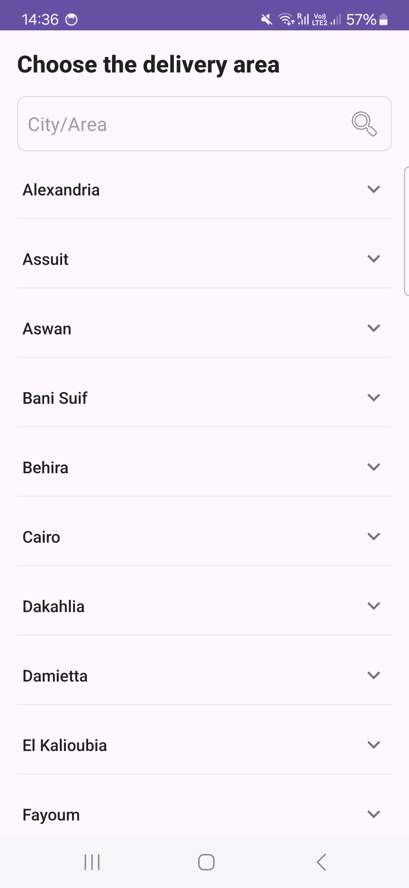
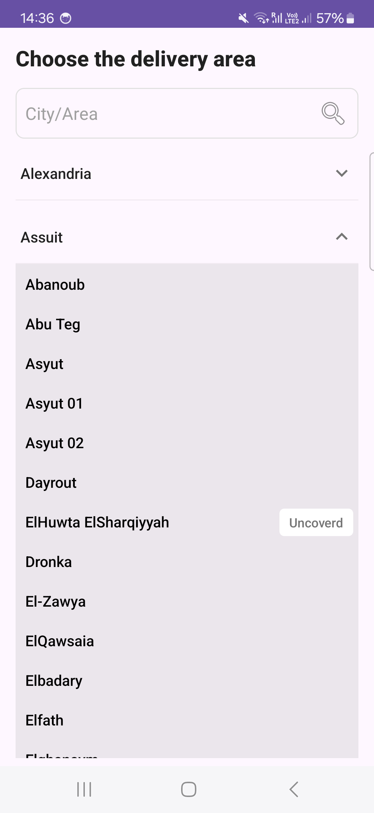
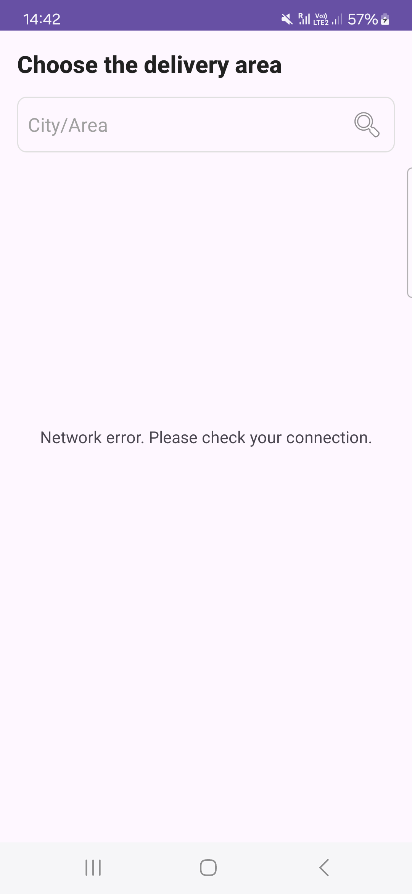

# 🚚 Bosta Task: Cities & Districts Explorer 🌍

Welcome to the Bosta Task project! This Android application allows users to explore cities and their respective districts based on a provided country ID. 🚀

## ✨ Project Strengths & Key Features

* **Clean Architecture 🏗️:**
    * Employs a robust and scalable architecture, separating concerns into Data, Domain, and Presentation layers.
    * Ensures maintainability and testability.
* **MVVM Pattern 📊:**
    * Utilizes the Model-View-ViewModel architectural pattern for efficient UI state management and data binding.
    * Provides a reactive and testable UI layer.
* **Kotlin Coroutines & Flow 🌊:**
    * Leverages Kotlin Coroutines and Flow for asynchronous operations, ensuring smooth and responsive UI.
    * Improves performance and handles background tasks efficiently.
* **Hilt Dependency Injection 💉:**
    * Implements Hilt for seamless dependency injection, simplifying code and enhancing testability.
    * Reduces boilerplate code and improves code organization.
* **Retrofit & Gson 🌐:**
    * Uses Retrofit for network communication and Gson for JSON parsing, ensuring reliable API interactions.
    * Handles API responses and data serialization efficiently.
* **RecyclerViews & ListAdapter 🔄:**
    * Employs RecyclerViews and ListAdapter for efficient and performant list rendering.
    * Ensures smooth scrolling, and efficient diff calculation.
* **Unit & Integration Tests ✅:**
    * Includes comprehensive unit tests for Data, Domain, and Presentation layers, ensuring code reliability.
    * Provides confidence in code changes and facilitates continuous integration.
* **User-Friendly UI 🎨:**
    * Intuitive and clean UI design, providing a seamless user experience.
    * Rounded EditText, and expand collapse functionality.

## 📋 Task Requirements Alignment

This project adheres to the following task requirements:

* **API Integration 📡:**
    * Successfully integrates with the provided API to fetch cities and districts data.
* **Data Display 📊:**
    * Displays the list of cities and their districts in a clear and organized manner.
* **Expand/Collapse Functionality 🔽🔼:**
    * Implements expand/collapse functionality for each city, allowing users to view districts.
* **Error Handling ⚠️:**
    * Robust error handling for network issues and data parsing errors.
* **Code Quality 🧑‍💻:**
    * Clean, well-documented, and maintainable code.
* **Testing 🧪:**
    * Appropriate Unit testing for all layers.

## 📱 App Screenshots

Here are some screenshots of the application:

### Cities List View



### Expanded City View




### Error State



## 🛠️ Getting Started

To get started with this project, follow these steps:

1.  **Clone the Repository 📥:**

    ```bash
    git clone [https://github.com/Aslmmon/Bosta-Task.git](https://github.com/Aslmmon/Bosta-Task.git)
    ```

2.  **Open in Android Studio 💻:**
    * Open the project in Android Studio.

3.  **Build & Run ▶️:**
    * Build and run the application on an emulator or physical device.

## 📚 Dependencies

* Retrofit
* Gson
* Hilt
* Kotlin Coroutines
* Kotlin Flow
* Mockito-Kotlin
* JUnit
* AndroidX Libraries


## 📥 Download the Release APK

You can download the latest release APK [here](https://github.com/Aslmmon/Bosta-Task/releases/download/v1.0/app-release.apk).

**Installation Instructions:**

1.  Download the APK file to your Android device.
2.  If prompted, enable "Install from Unknown Sources" in your device settings.
3.  Open the APK file to install the app.

## ⚠️ Warning

This is a release APK for testing purposes. The app might not be stable and could contain bugs.


## 🤝 Contributing

Contributions are welcome! Feel free to submit pull requests or open issues.

## 📄 License

[MIT License](LICENSE)

---

Thank you for checking out the Bosta Task project! 🎉
